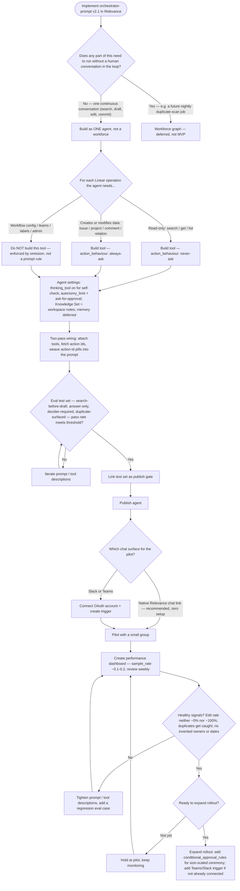

# Build decision tree — implementing orchestrator-prompt-v2.1 in Relevance

Visual companion to `relevance-implementation-plan.md`. Each diamond is a
decision point in the proposed build; the two open ones (chat surface,
rollout expansion) are left as forks rather than pre-decided, since they
depend on which chat platform the AI Lab wants first and on real pilot data
that doesn't exist yet.

## Reading the tree

- **Top fork (architecture)** resolves to a single agent, not a workforce —
  because nothing in v2.1 needs to run without a human in the conversation.
  The workforce branch is kept visible because it's the right call *later*,
  for a genuinely separable job like a scheduled duplicate-scan.
- **Second fork (tool surface)** is where the enforcement actually lives —
  three outcomes per Linear operation, and the third (workflow config / admin)
  is a tool that's simply never built, which is the mechanism-level version
  of "never touch workflow configuration" instead of a prompt rule that
  competes for attention with everything else in the prompt.
- **Eval gate** is a real loop, not a one-way arrow: failing scenarios send
  you back to iterate, and only a passing test set unlocks publish.
- **Chat surface** is left open deliberately — it's a real choice, not
  something to default silently.
- **Bottom loop (post-launch)** doesn't terminate at "expand rollout" — it's
  a monitoring loop that keeps running (dashboard → health check → tighten or
  hold or expand) for as long as the agent is live, which is the concrete
  answer to "the system needs a feedback loop, not a one-shot launch."
